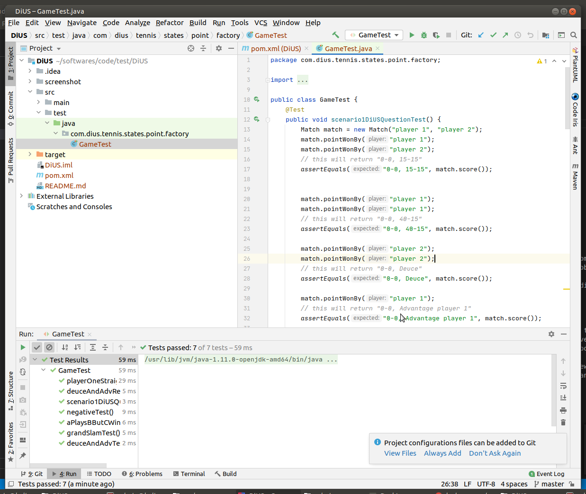
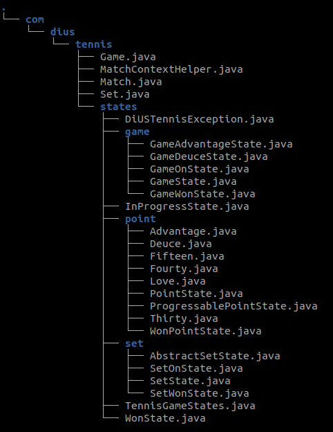
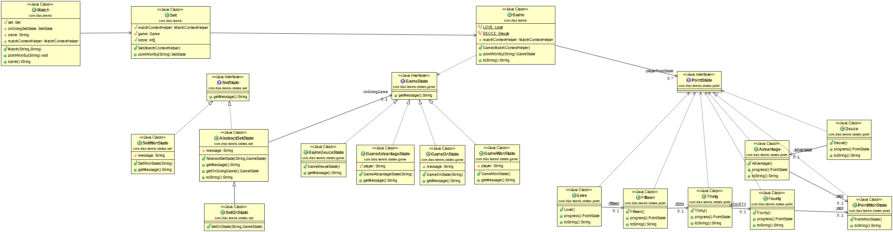

# DiUS Tennis
https://github.com/DiUS/coding-tests/blob/master/dius_tennis.md

# Softwares Reqd.
* jdk
* mvn
* intellij(optional)

# Run using MVN:
```
$ mvn -e clean install
$ mvn -e test 
```

# Run using intellij
Ctrl+Shift+f10



# Folder structure


# Class Diagram 
```Note: Only main classes and important relationships```


# Design Mindset & Design Principles.
State classes make up some of the main constituents of the domain model. A Match object represents an instance of a match (one competition). I am not an expert in tennis but as I understand a competition can only be between 2 players or 2 teams (each consisting of 2 player). Thus the match object take 2 String name inputs. A Win Event triggers a Match operation on a Match instance which delegates the operation call to a (Tennis)Set and inturn a Game. 
A Game, Set, Match is represented by point system and rules surrounding them as mentioned in the problem. These points can have different states based on the rule that determines the progress of the game.
```Note:```They shouldn't be confused with Finite-State Machine.  

In short, A Match can be played in one or more Sets (I guess odd number of Sets). As question has instructed I have assumed it to be 1, but extending can happen without much effort. A Set consists of Games which is made of points. These points(one for each player) can have many states, Love, 15, 30, 40, Deuce, Advantage etc. States are defined in the states.points package (Common Closure Principle). The domain objects in the solution follow Single Responsibility principle (SRP) and the state itself follow Open Close Principle (OCP).  
In a real world scenrio, a MatchContextHelper would be replaced with context objects based on a Dependency Injection (IOC Framework such as spring) to inject a context into model classes rather than other way round. Additionally, all validation would be kept away from the context helper and encapsulated into its validation classes. Additionally pricinples such as Interface Seggregation Principle is also used to prevent clients from depending on methods it doesn't use.
